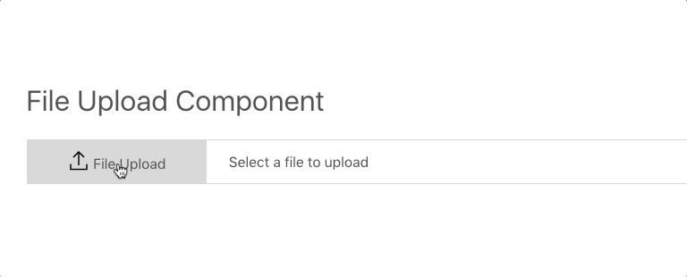

# Blacktie (beta)

 BlackTie is a framework agnostic reusable collection of UX/UI patterns, libraries and tools created to make it easy to customize and enhance FrontEnd frameworks like bootstrap, adding missing utilities and elements.


## Sass/CSS

A lightweight SASS/CSS utility library (30kb / 8Kb gzip) that makes it easy to customize UI elements, it's goal is to enhance and not replace your current framework.

## WebComponents


> [Web components](https://www.webcomponents.org/introduction) are a set of web platform APIs that allow you to create new custom, reusable, encapsulated HTML tags to use in web pages and web apps. Custom components and widgets build on the Web Component standards, will work across modern browsers, and can be used with any JavaScript library or framework that works with HTML.


### Confirm Actions

** Ask users to confirm an actions before actions (delete /update) before submissions **


``` html
<bts-confirm-actions></bts-confirm-actions>
<bts-confirm-actions url="/" label="Remove"></bts-confirm-actions>

```
_________________________________________________

### Top Anchor

BlackTie Top Anchor component add a scroll to top element to any page


__Scrolling displays hidden top anchor element__


__Click top anchor to scroll to top of page__

``` html
<bts-top-anchor></bts-top-anchor>
```
_____________

### Upload Component

Replace a basic file input browser element with a Stylized custom upload component.



``` html

<div class="content">
<p><bts-upload-elm></bts-upload-elm></p>
</div>

```


# Quick Start

* Clone the repo

```
git clone https://github.com/shawnsandy/blacktie
```

* Install node modules

``` bash
yarn install
```

* Start the development environment

```
yarn run start
```

#### Use the package in you local development by running

* Run `yarn link` in the directory you cloned the package into.
* Run `yarn link "blacktie"` from you local development directory.
* More info on [Package linking](https://yarnpkg.com/lang/en/docs/cli/link/)


Coming soon
____________

BlackTie is still under development more info coming soon..
